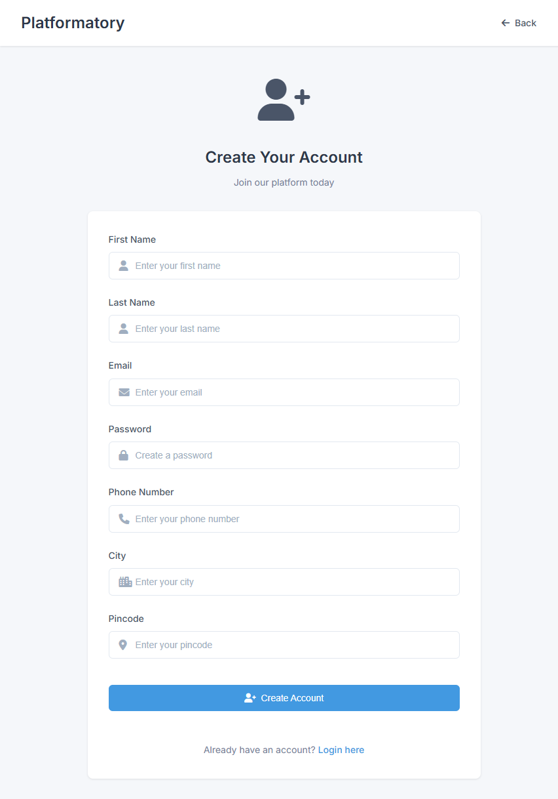
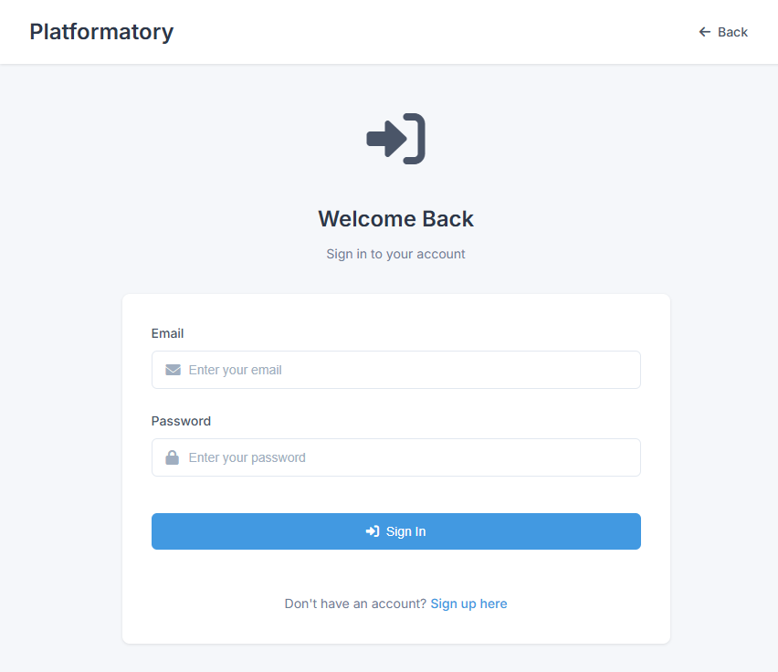
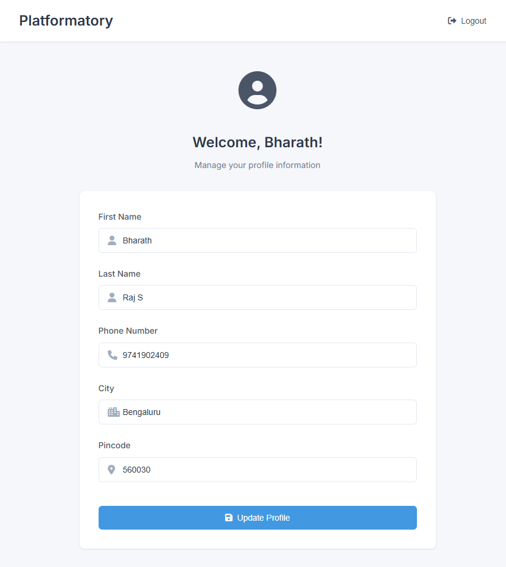

# Platformatory

A modern web application built with Node.js, TypeScript, and Temporal.io for robust workflow management. This project demonstrates a user authentication and profile management system with automatic data synchronization using Temporal workflows.

## 🚀 Features

- **User Authentication**: Sign up, login, and logout functionality
- **Profile Management**: Update user profiles with validation
- **Temporal Workflows**: Robust workflow orchestration for data synchronization
- **MongoDB Integration**: Persistent data storage
- **External API Sync**: Automatic synchronization with CrudCrud API
- **Docker Support**: Containerized deployment with Docker Compose
- **Modern UI**: Clean, responsive frontend interface

## 🏗️ Architecture

### Backend Stack
- **Runtime**: Node.js with TypeScript
- **Framework**: Express.js
- **Database**: MongoDB with Mongoose ODM
- **Workflow Engine**: Temporal.io
- **Authentication**: bcryptjs for password hashing
- **HTTP Client**: Axios for external API calls

### Frontend Stack
- **HTML5/CSS3/JavaScript**: Vanilla web technologies
- **Styling**: Custom CSS with modern design
- **Icons**: Font Awesome
- **Fonts**: Google Fonts (Inter)

### Infrastructure
- **Containerization**: Docker with multi-stage builds
- **Reverse Proxy**: Nginx for frontend serving and API proxying
- **Orchestration**: Docker Compose for multi-service deployment

## 📁 Project Structure

```
Platformatory/
├── frontend/                 # Frontend static files
│   ├── index.html           # Landing page
│   ├── login.html           # Login page
│   ├── signup.html          # Signup page
│   ├── profile.html         # Profile management page
│   ├── script.js            # Frontend JavaScript
│   └── styles.css           # Frontend styles
├── src/                     # Backend source code
│   ├── config/
│   │   └── database.ts      # MongoDB connection configuration
│   ├── models/
│   │   └── User.ts          # User data model
│   ├── activities.ts        # Temporal activities
│   ├── workflows.ts         # Temporal workflows
│   ├── worker.ts            # Temporal worker
│   └── server.ts            # Express server
├── docker-compose.yml       # Docker Compose configuration
├── Dockerfile.backend       # Backend Docker configuration
├── Dockerfile.frontend      # Frontend Docker configuration
├── nginx.conf              # Nginx configuration
├── package.json            # Node.js dependencies
└── tsconfig.json           # TypeScript configuration
```

## 🛠️ Prerequisites

- **Node.js** (v18 or higher)
- **Docker** and **Docker Compose**
- **MongoDB** (or use the containerized version)
- **Temporal Server** (or use the containerized version)

## 🚀 Quick Start

### Option 1: Docker Compose (Recommended)

1. **Clone the repository**
   ```bash
   git clone <repository-url>
   cd Platformatory
   ```

2. **Start all services**
   ```bash
   docker-compose up --build
   ```

3. **Access the application**
   - Frontend: http://localhost
   - Backend API: http://localhost:3000
   - Temporal UI: http://localhost:8080

### Option 2: Local Development

1. **Install dependencies**
   ```bash
   npm install
   ```

2. **Set up environment variables**
   Create a `.env` file in the root directory:
   ```env
   MONGODB_URI=mongodb://localhost:27017/platformatory
   CRUDCRUD_API=https://crudcrud.com/api/your-api-key
   NODE_ENV=development
   ```

3. **Start Temporal server**
   ```bash
   temporal server start-dev --ui-port 8080
   ```

4. **Start MongoDB** (if not using Docker)
   ```bash
   mongod
   ```

5. **Build and run the application**
   ```bash
   # Build TypeScript
   npm run build
   
   # Start the server
   npm start
   
   # Or run in development mode
   npm run dev
   ```

6. **Start the Temporal worker** (in a separate terminal)
   ```bash
   npx ts-node src/worker.ts
   ```

## 🔧 Configuration

### Environment Variables

| Variable | Description | Default |
|----------|-------------|---------|
| `MONGODB_URI` | MongoDB connection string | `mongodb://mongodb:27017/platformatory` |
| `CRUDCRUD_API` | CrudCrud API endpoint | `https://crudcrud.com/api/94cf328e3f0d469ab2c0fb19fda8ca05` |
| `NODE_ENV` | Application environment | `production` |

### API Endpoints

#### Authentication
- `POST /api/auth/signup` - User registration
- `POST /api/auth/login` - User login
- `POST /api/auth/logout` - User logout

#### Profile Management
- `PATCH /api/profile/:id` - Update user profile

## 🔄 Temporal Workflows

The application uses Temporal.io for robust workflow orchestration:

### Workflow Features
- **Automatic Retries**: Built-in retry policies for failed operations
- **State Management**: Persistent workflow state
- **Signal Handling**: Real-time profile updates
- **Activity Coordination**: Sequential execution of database and API operations

### Workflow Process
1. User profile update triggers workflow
2. Save to local MongoDB database
3. Wait 10 seconds for consistency
4. Sync to external CrudCrud API
5. Listen for future updates via signals

## 🐳 Docker Services

The Docker Compose setup includes:

- **Frontend**: Nginx serving static files on port 80
- **Backend**: Node.js API server on port 3000
- **MongoDB**: Database service on port 27017
- **Temporal**: Workflow engine on port 7233
- **Temporal Admin**: Admin tools for workflow management

## 🧪 Development

### Available Scripts

```bash
npm run dev      # Start development server with ts-node
npm run build    # Compile TypeScript to JavaScript
npm start        # Start production server
```

### Code Structure

- **Models**: Mongoose schemas for data validation
- **Activities**: Temporal activities for external operations
- **Workflows**: Temporal workflows for orchestration
- **Server**: Express.js API endpoints
- **Worker**: Temporal worker for executing activities

## 🔒 Security Features

- **Password Hashing**: bcryptjs for secure password storage
- **Input Validation**: Server-side validation for all inputs
- **CORS Configuration**: Cross-origin resource sharing setup
- **Environment Variables**: Secure configuration management

## 📊 Data Flow

1. **User Registration**: User data → MongoDB → Temporal Workflow → CrudCrud API
2. **Profile Updates**: Updated data → MongoDB → Temporal Signal → Workflow → CrudCrud API
3. **Authentication**: Credentials → bcrypt verification → JWT (future enhancement)

## 🚀 Deployment

### Production Deployment

1. **Build Docker images**
   ```bash
   docker-compose build
   ```

2. **Deploy with Docker Compose**
   ```bash
   docker-compose up -d
   ```

3. **Monitor services**
   ```bash
   docker-compose logs -f
   ```

### Environment-Specific Configurations

- **Development**: Use `NODE_ENV=development`
- **Production**: Use `NODE_ENV=production` with proper MongoDB URI

## 🤝 Contributing

1. Fork the repository
2. Create a feature branch
3. Make your changes
4. Add tests if applicable
5. Submit a pull request

## 📝 License

This project is licensed under the ISC License.

## 🆘 Troubleshooting

### Common Issues

1. **MongoDB Connection Failed**
   - Ensure MongoDB is running
   - Check `MONGODB_URI` environment variable

2. **Temporal Workflow Errors**
   - Verify Temporal server is running
   - Check worker is started: `npx ts-node src/worker.ts`

3. **Docker Compose Issues**
   - Clean up containers: `docker-compose down -v`
   - Rebuild images: `docker-compose up --build`

4. **API Connection Issues**
   - Verify backend is running on port 3000
   - Check CORS configuration
   - Ensure frontend API_BASE_URL is correct

### Logs and Debugging

- **Backend logs**: `docker-compose logs backend`
- **Frontend logs**: `docker-compose logs frontend`
- **Temporal logs**: `docker-compose logs temporal`

## 📸 Screenshots

### Welcome Page


### Signup Page


### Login Page


### Profile Page

