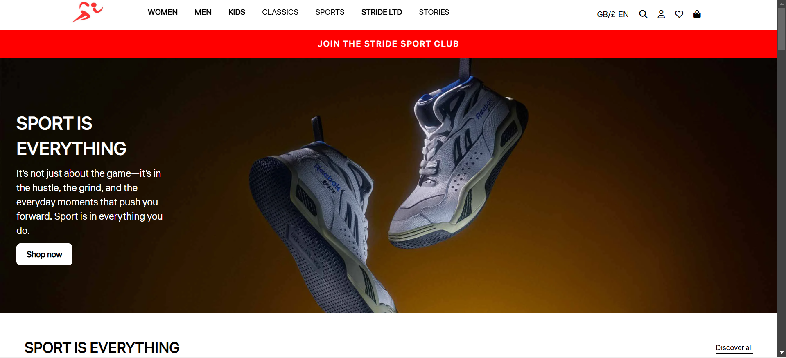
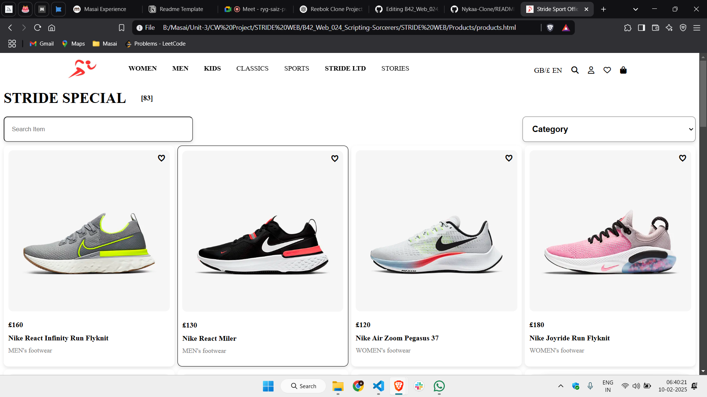
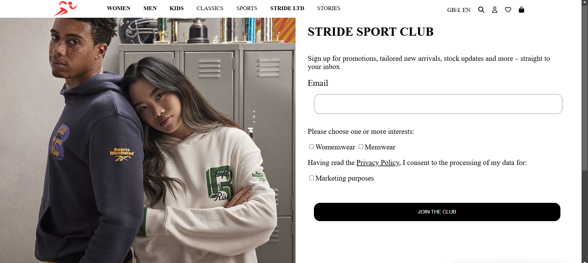
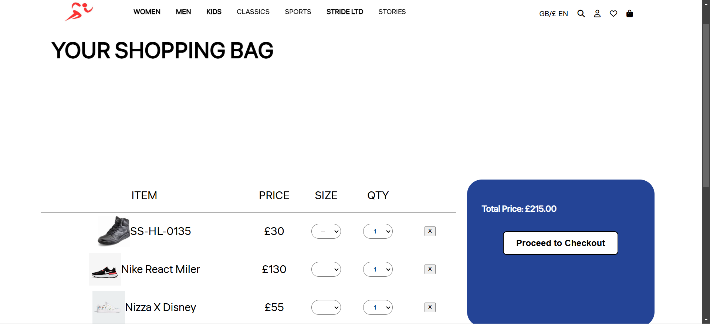
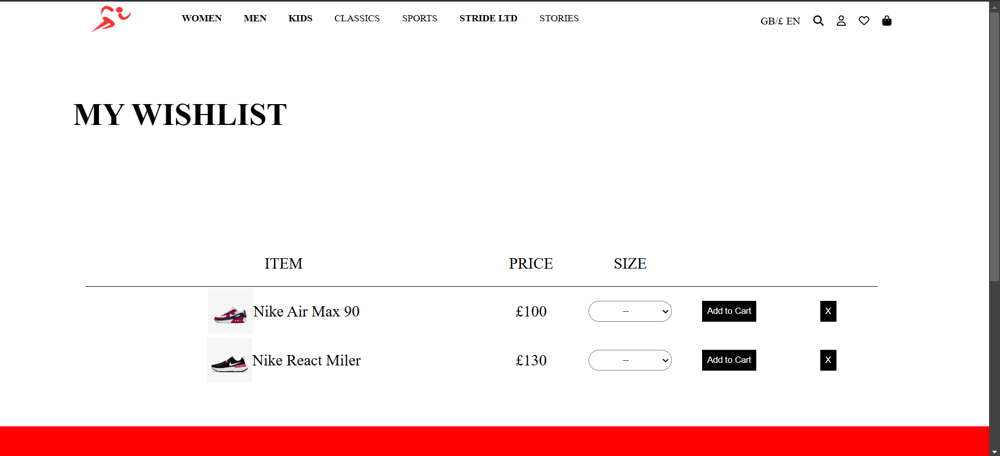

# Stride Sport

## Introduction
The Stride Sport is a replica of the Reebok online store, designed to provide a seamless shopping experience. It allows users to browse products, add items to their cart, and complete purchases securely. With features like product filtering, user sign-in, and a responsive design, this project showcases essential e-commerce functionalities while improving development skills in front-end technologies.

## Project Type
Frontend

## Deployed App
[Live Demo](https://stridesport.netlify.app/)

## Directory Structure
Stride Sport/
├── cart.html
├── cart.css
├── cart.js
├── club.html
├── club.css
├── club.js
├── index.html      # Main HTML file
├── index.css       # CSS file for styling
├── index.js        # JavaScript file for interactions
├── productDetails
├── products.html
├── products.css
├── products.js
├── signin.html
├── signin.css
├── signin.js
├── wishlist.html
├── wishlist.css
└── wishlist.js


## Video Walkthrough
[Watch Demo](https://drive.google.com/file/d/1SRczK0EZ-v9s3MkNCO5evWbyiMypY-Oo/view?usp=sharing)

## Glimpse and Screenshots of our cloned website:
<table>
   <tr align=center>
     <td  colspan=3>Landing Page</td>
  </tr>
  <tr align=center>
    <td>Sign in Page</td>
    <td>Product Page</td>
    <td>Club Page</td>
  </tr>
  <tr align=center>
    <td>Cart Page</td>
    <td>Wishlist Page</td>
    <td>Footer </td>
  </tr> 
</table>

## Features
- User Sign In & Registration  
- Add Products To The Cart  
- Add Products To The Wishlist  
- Join the Stride Sport Club  

## Design Decisions & Assumptions
The Stride Sport is a frontend-based website built using HTML, CSS, and JavaScript to replicate the look and feel of Reebok's official website. The design focuses on a clean and responsive UI, ensuring a smooth user experience across different devices. JavaScript is used for interactive elements such as navigation menus, product filtering, and basic cart functionality.  

This project helps in understanding UI design, styling, and DOM manipulation to create a visually appealing e-commerce platform.

## Installation & Getting Started
### Prerequisites
Before you begin, ensure you have the following installed on your system:
- A modern web browser (Chrome, Firefox, Edge, etc.)
- A code editor (VS Code, Sublime Text, etc.)
- Git (optional, for version control)

### Installation Steps
#### Clone the Repository (if hosted on GitHub)
If you have uploaded your project to GitHub, you can clone it using the following command:
```sh
git clone https://github.com/ankithmandal09/B42_Web_024_Scripting-Sorcerers
cd reebok-clone
```
 ⁍ **Akshay Shinde**:
 - Linkedin: http://linkedin.com/in/akshayshinde2
   
 ⁍ **Ankith Mandal**:
 - Linkedin: www.linkedin.com/in/ankith-mandal-030296276
   
 ⁍ **Bharath Raj**:
 - Linkedin: https://www.linkedin.com/in/bharathrajs1807

## Show your support

Give a ⭐️ if you like this project!
